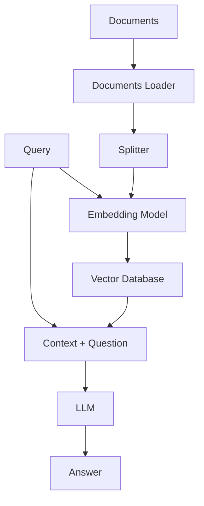
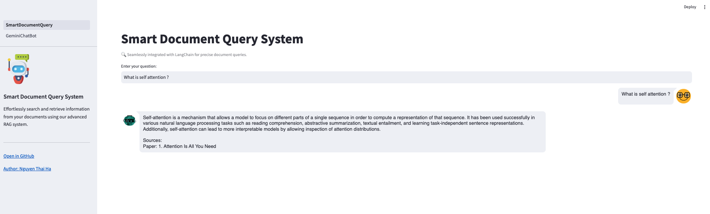
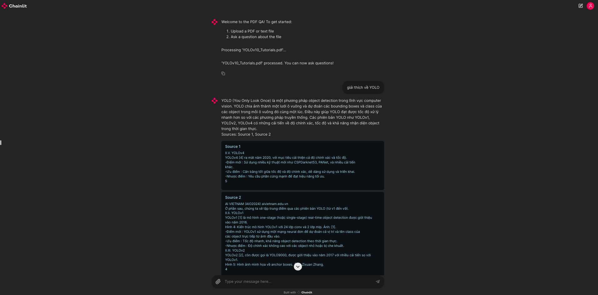
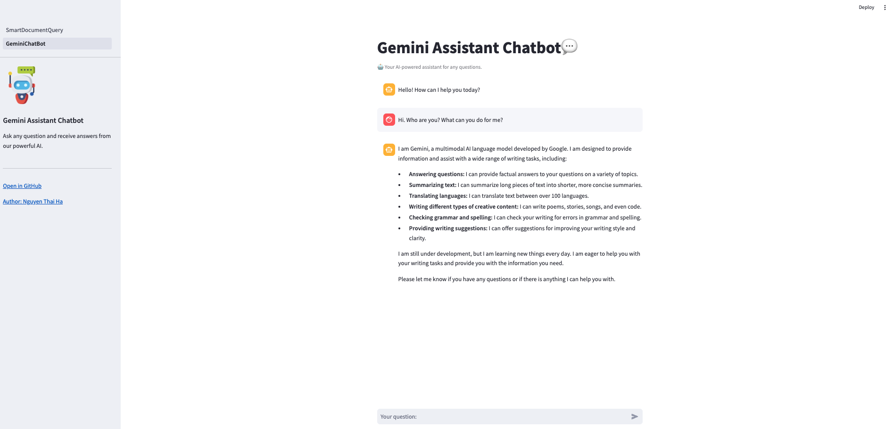

# RAG (Retrieval-Augmented Generation) System using LangChain with Streamlit and Chainlit UI Interface

This project is a Retrieval-Augmented Generation (RAG) system designed to query customized documents such as PDFs and can be scaled to accommodate other types of documents. The system utilizes Streamlit and Chainlit to build app UI interface and Pinecone and Chroma as the vector database.

## Project Overview

The flow of the project is illustrated below:



## Components

1. **Document Loaders**: Responsible for loading documents of various types (HTML, PDF, TXT) into the system.
2. **Splitter**: Splits the loaded documents into manageable chunks for processing.
3. **Embedding Model**: Converts document chunks into embeddings.
4. **VectorDB (Currently using Chroma and Pinecone)**: Stores and retrieves embeddings efficiently.
5. **Query**: User's input query that needs to be answered.
6. **Context and Question**: The context retrieved from the VectorDB and the user's question.
7. **LLM (Large Language Model)**: Processes the context and question to generate an answer.

   ※ _Interface of this flow was build by Streamlit and Chainlit_

## Demo

### Smart Document Query System

Effortlessly search and retrieve information from your documents using our advanced RAG system. The sources is shown below the answer.

#### Smart Document Query System - Streamlit Interface



#### Smart Document Query System - Chainlit Interface



#### Gemini Assistant Chatbot

Ask any question and receive answers from our powerful AI.



## Project Structure

```
.
├── LICENSE                             # MIT license
├── README.md                           # Project overview and instructions
├── SmartDocumentQueryST.py             # Main script for the Smart Document Query system - Streamlit Interface
├── SmartDocumentQueryCL.py             # Main script for the Smart Document Query system - Chainlit Interface
├── data_source
│   ├── download.py                     # Script to download data sources
│   ├── pdf_file                        # Directory containing PDF files for the project
│   ├── pdf_file_test
│   │   └── Attention_Is_All_You_Need.pdf  # Sample PDF file for testing
│   └── pdf_file_test
│   │   └── YOLOv10_Tutorials.pdf       # Document for YOLOv10 (using to test chainlit interface)
├── icons
│   └── chatbot.png                     # Icon for the chatbot
├── images
│   ├── demo_smart_document_query_st_ui.png   # Image for the Smart Document Query system demo - Streamlit Interface
│   ├── demo_smart_document_query_cl_ui.png   # Image for the Smart Document Query system demo - Chainlit Interface
│   └── gemini_assistant_chatbot_01.png       # Image for the Gemini Assistant Chatbot demo
├── pages
│   └── 1_GeminiChatBot.py              # Streamlit page for the Gemini Assistant Chatbot
├── requirements.txt                    # List of project dependencies
└── src
    ├── build_db.py                     # Script to build the vector database by Pinecone
    ├── const.py                        # File containing project constants
    ├── document_loaders
    │   ├── base.py                     # Base class for document loaders
    │   └── pdf.py                      # PDF document loader implementation
    ├── logger
    │   └── simple_logger.py            # Simple logger implementation
    ├── model
    │   └── llms.py                     # Script containing LLM-related functionalities
    ├── retriever.py                    # Script for the retriever functionality
    ├── splitters
    │   └── text_splitter.py            # Script for splitting text into chunks
    └── vector_db
        ├── base.py                     # Base class for vector databases
        ├── chroma_db.py                # Chroma vector database class
        └── pinecone_db.py              # Pincecone vector databases class
```

## How to Run

### Prerequisites

- Python 3.8+
- Streamlit
- Chainlit
- LangChain
- Pinecone

### Installation

1. Clone the repository:

   ```bash
   git clone https://github.com/nguyenhads/rag_system_with_ui_interface.git
   cd rag_system_with_ui_interface
   ```

2. Create a virtual environment and install the required packages:

   ```bash
   python -m venv .venv
   source .venv/bin/activate
   pip install -r requirements.txt
   ```

3. Set up Pinecone:

   - Sign up at [Pinecone](https://www.pinecone.io/) and get your API key.
   - Create an index on Pinecone for storing document embeddings.
   - Update `src\const.py` with your INDEX_NAME, NAME_SPACE (optinal)

4. Set up your environment variables:

   - Create a `.env` file in the project root and add your OpenAI and Pinecone API keys (examples provided in .env.sample)

   ```bash
   # API keys
   OPENAI_API_KEY=your-openai-api-key
   PINECONE_API_KEY=your-pinecone-api-key
   GOOGLE_API_KEY=your-google-api-key

   #Python Path
   PYTHONPATH=/path/to/src/folder
   ```

5. Build a vector store DB using Pinecone

   ```bash
   python src/build_db.py <folder_containing_pdf_files>
   ```

6. Running a Streamlit app or Chainlit app

   ```
   streamlit run SmartDocumentQueryST.py

   chainlit run SmartDocumentQueryCL.py
   ```

## Acknowledgements

- [LangChain](https://github.com/langchain-ai/langchain)
- [Streamlit](https://www.streamlit.io/)
- [Chainlit](https://docs.chainlit.io/get-started/overview)
- [Pinecone](https://www.pinecone.io/)

## License

This project is licensed under the MIT License.
